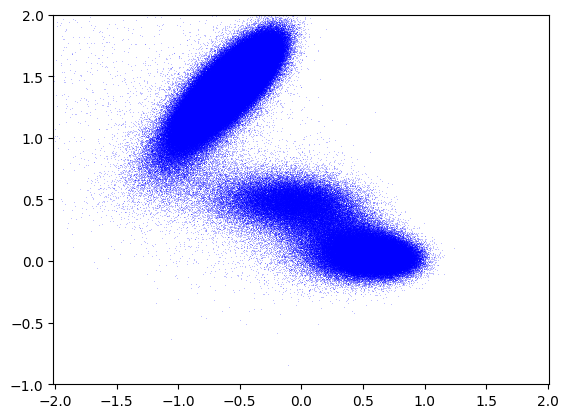

<h2>Intro</h2>

This tool simulates particle trajectories and generates binary output
files containing the sampled positions. The simulation is parallelized
across all available CPU cores for efficient data generation.

<h2>Install</h2>

```
python -m pip install .
```

<h2>Generate</h2>

```
$ python generate.py -h
usage: generate.py [-h] -n NSTEPS -p PERIOD -o OUTPUT

optional arguments:
  -h, --help            show this help message and exit
  -n NSTEPS, --nsteps NSTEPS
                        Number of steps
  -p PERIOD, --period PERIOD
                        Period of recording
  -o OUTPUT, --output OUTPUT
                        Output binary file
```

To generate large datasets efficiently, the script generate.sh
launches multiple parallel processes—one for each CPU core. Each
process generates 1 million samples and stores them in a separate
binary file:

```
$ cat generate.sh
seq `nproc` | xargs -P 2 -n 1 sh -c '
    GSL_RNG_SEED=$1 python generate.py -n 1000000 -p 1000 -o traj.$1.bin
' dummy
$ sh generate.sh 
$ python view.py -o traj.png traj.*.bin
view.py: traj.png: 2000000 points
```
<p align="center" alt="Sampled particle position"></p>

<h2>References</h2>

- Müller, K., Brown, L.D. Location of saddle points and minimum energy paths by a constrained simplex optimization procedure. Theoret. Chim. Acta 53, 75–93 (1979). [10.1007/BF00547608](https://doi.org/10.1007/BF00547608)